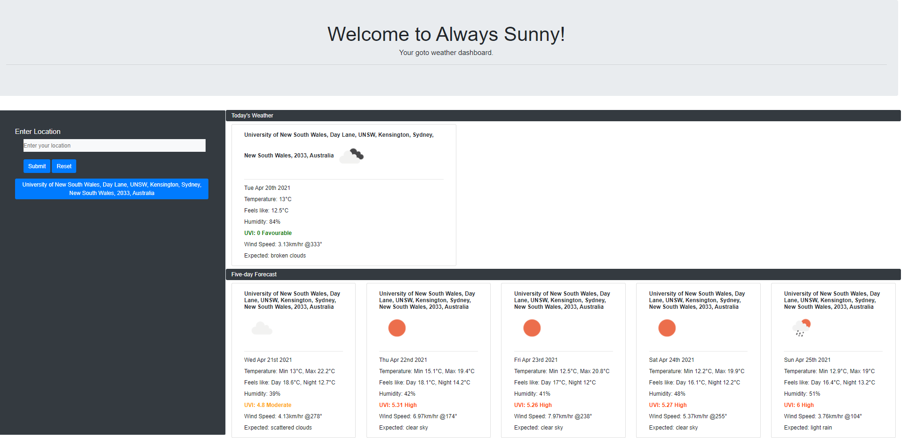

# Always Sunny Weather Dashboard

## Description

This is a Weather Dashboard Application that uses Openweather API to retrieve current and forecasted weather for a specific location. It allows users to save their searches to the local storage to ease the future search process.

### Usage

You need to start typing inside the location search box. A dropdown menu will appear, from which you need to select the desired location. Click 'Submit'. Get your weather forecast!

## Link to the Deployed Application

[Always Sunny Weather Dashboard](https://forester93.github.io/always-sunny/)

## Link to the Github Repository

[Always Sunny Github Repo](https://github.com/Forester93/always-sunny/)

## Screenshot of the Application

## Contact me

| Name          | Email                    | Phone Numer         |
| ------------- | ------------------------ | ------------------- |
| Mark Forester | markforester93@gmail.com | +61 (0) 404-831-362 |
